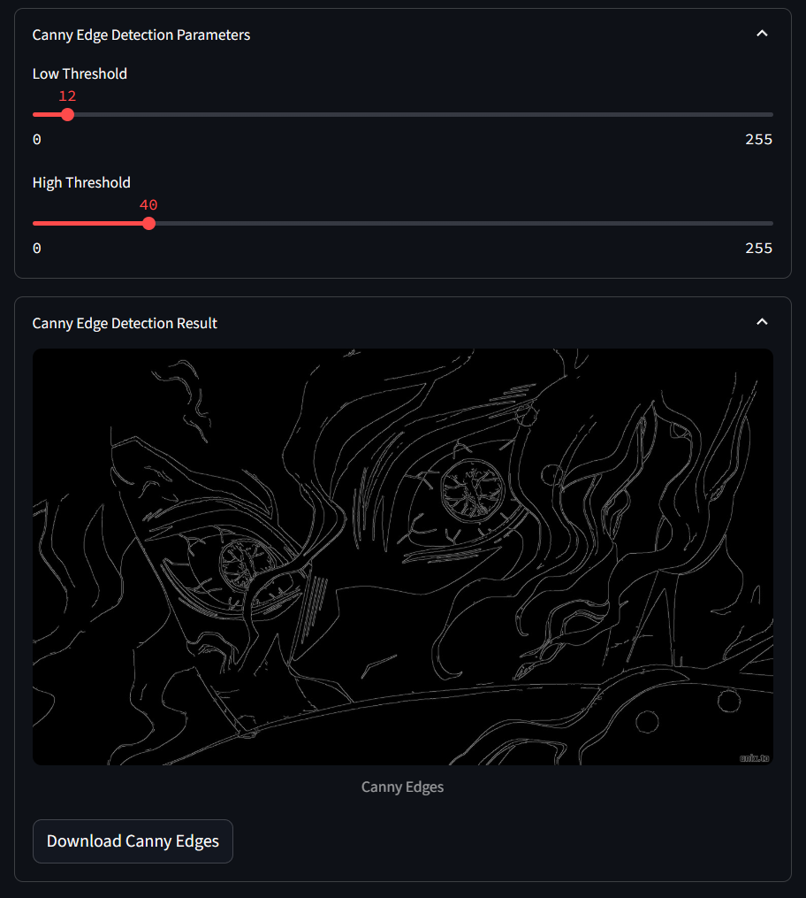

# 📸 Simple Image Processing with OpenCV

This Streamlit web app lets you upload an image and apply interactive filters and adjustments using OpenCV.

## 📽 Demo





---

## ✨ **Features**
- Upload and preview images (JPG, JPEG, PNG)
- Convert to grayscale
- Apply Gaussian blur
- Invert image colors
- Rotate images by custom angle
- Adjust brightness and contrast
- Edge detection (Canny)
- Thresholding (binary)
- Compare original vs. filtered image
- Download processed images

---

## 🛠 **Installation**

Clone the repository and install the requirements:

```bash
pip install -r requirements.txt
```

## 🚀 **Run the app**
```bash
streamlit run app.py
```


ذ
